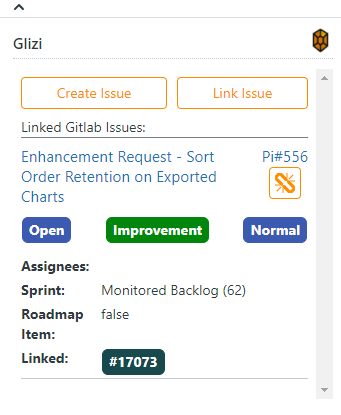
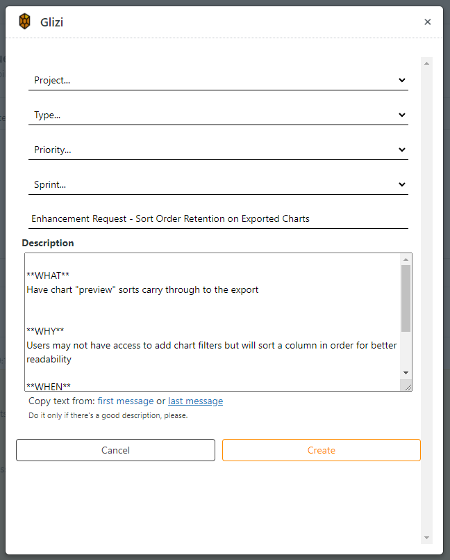
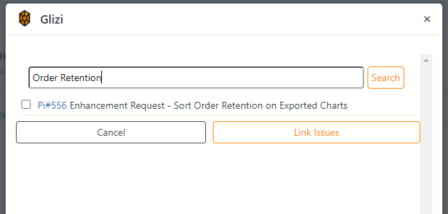
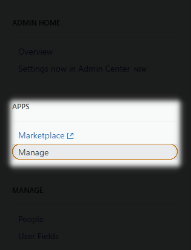
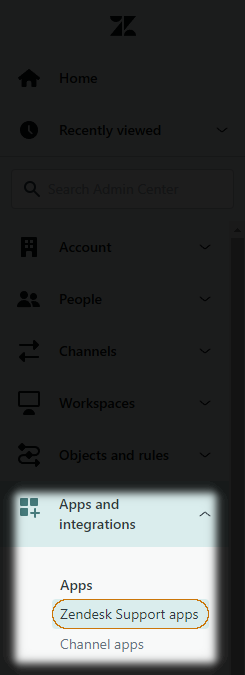
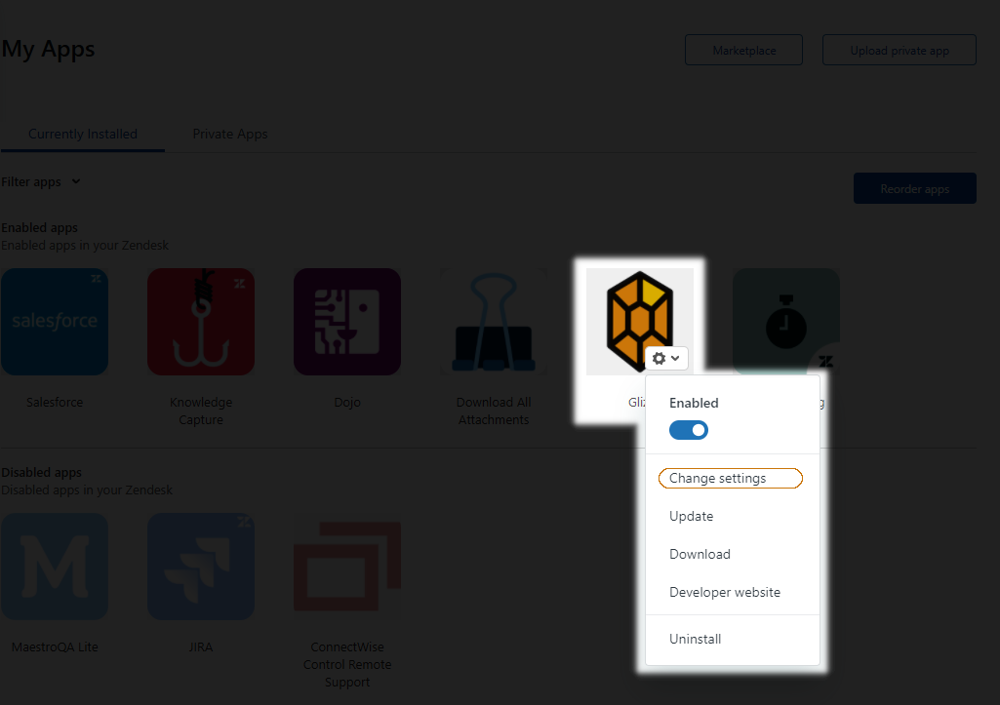
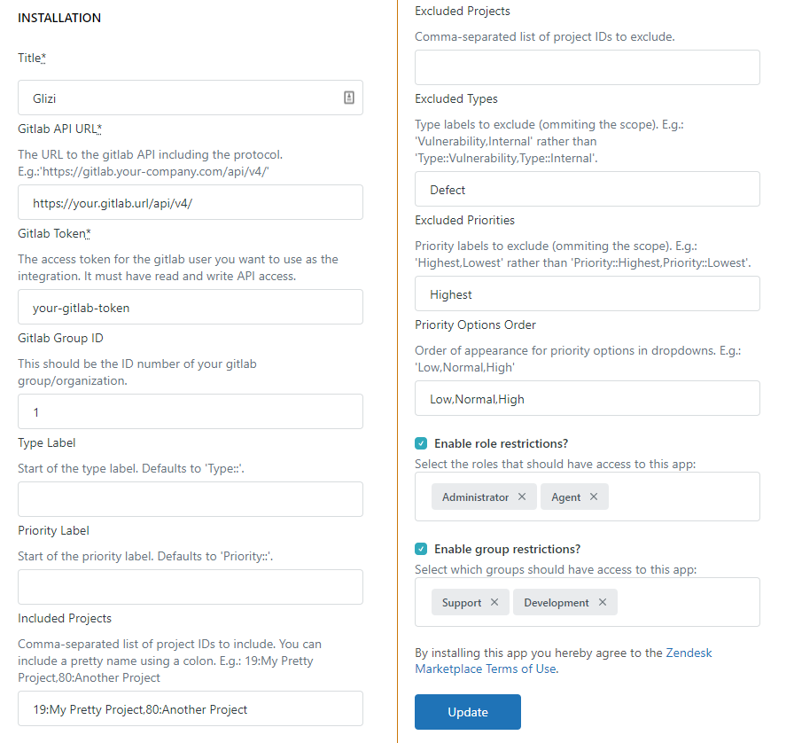

# Glizi

A Zendesk App to integrate your [Zendesk Servicedesk](https://www.zendesk.co.uk/) with [Gitlab Issues](https://gitlab.com/), especially a self-managed one.

Please submit bug reports to [Issues](https://github.com/dosaki/glizi/issues).

[Pull requests are welcome](https://github.com/dosaki/glizi/pulls).

If this is helpful for you, [buy me a beer](https://paypal.me/tdosaki) :)

## How it Works
After [configuring Glizi](#configuration), it searches your Gitlab issues via the API for issues with a label that matches `Zendesk:#` where `#` is the number of the issue you're currently viewing.

Similarly, when creating or linking an issue, Glizi will create and apply a label following the same convention as well as links to the original Zendesk ticket at the bottom of the issue description.

## Screenshots:

## Configuration

### Find your Apps in your zendesk admin centre

| Old Interface | New Interface |
|---------------|---------------|
|  |  |

### Find Glizi to change settings

### Configure the required settings:

The only required settings are `Gitlab API URL` and `Gitlab Token`, everything else has defaults but you might want to change them in order to adapt to your particular Gitlab Issues set up.

#### Configuring Extra Labels

You can flag additional labels by filling in the `Extra Labels` option, this would make some extra options you can tick that get translated into additional labels on gitlab.

Fill them in with a comma-separated string (e.g. `Label 1, Label 2, Label 3`) or add some auto-ticking logic with the format `Field to use{String to find}:Label 1`

* `Field to use` supports `Title` and `Organisation` (or `Organization`);
* `String to find` can be prefixed `~` (contains), `!~` (not contains), `=` (equals) and `!=` (not equals). If not prefixed, it defaults to `~`;
* `Label 1` is the name of the label that will be shown as an option and automatically ticket in case the condition is successful.

For example:
`Title{~}`
